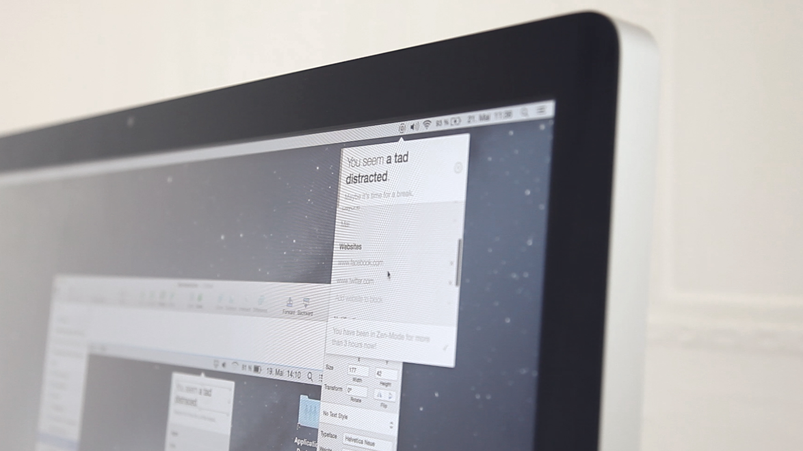
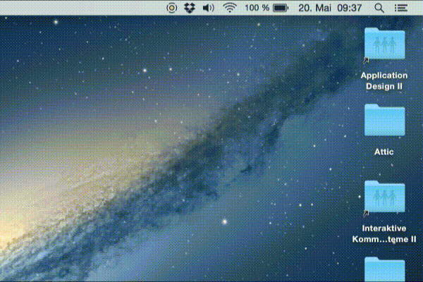

# Zen-Mode

[](https://vimeo.com/128536502)

**Zen-Mode is an application that helps you focus on your workflow and improve your working environment.**

> Watch the video on [Vimeo](https://vimeo.com/128536502) or read more about the concept on [Medium](https://medium.com/@ChristophLabacher/zen-mode-b0fe69d13ce6)!

It includes a hardware device which measures noise, brightness and the quality of the air. A sensor within the mouse is used to measure your stress level. The software tells you when there is something about you workspace that needs to be improved and when it might be time to take break. It uses an unintrusive natural language interface and only shows you information when you click on it in order to not be more distractive then helpful. With just a few clicks you can add websites, apps and notifications to be blocked during your focus time, so you can’t slack off or get sidetracked.

Zen-Mode was created during the international seminar week at the HfG Schwäbisch Gmünd by Julia Konrad, [Miguel Pawlowski](www.miguelpawlowski.de) and [Christoph Labacher](www.christophlabacher.com) in a workshop by Dr. Venere Ferraro.

## How to use the prototype



```
Arrow right: Next notification
Arrow up: Show browser
Arrow left: Resets browser after unblocking
```
